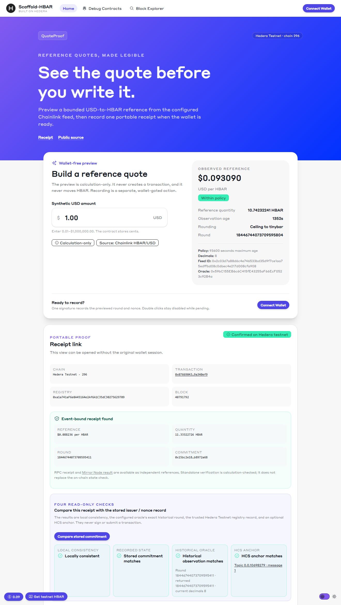
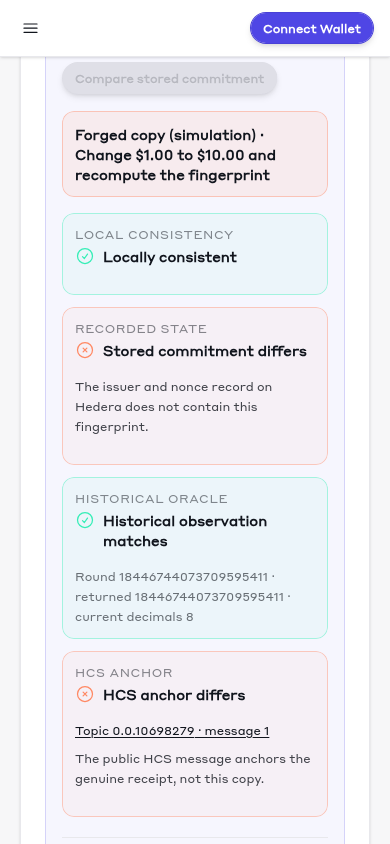
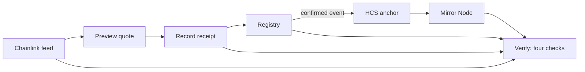

# QuoteProof — reference-quote receipts on Hedera

[](https://github.com/ref-dev22/quoteproof-template/actions/workflows/lint.yaml)
[](https://github.com/ref-dev22/quoteproof-template/actions/workflows/external-scaffold-release.yml)

A shop quotes $1.00 in USD, records the corresponding HBAR reference on Hedera Testnet, and gives anyone a receipt to verify the exact Chainlink oracle round used. This Scaffold-HBAR template is for Hedera developers building auditable reference quotes before a wallet write.

Scaffold-HBAR's built-in [`oracles` template](https://github.com/hedera-dev/scaffold-hbar/tree/templates/oracles) shows how to read Chainlink, Supra and Pyth prices. QuoteProof shows how to prove later, to anyone, which exact price a quote used.

It does more than read a price feed: anyone can verify a receipt later down to the exact oracle round, without a wallet, key, Docker or database. Optional HCS anchoring happens only after the receipt's on-chain event is confirmed. Anyone reads anchors from the public Mirror Node; the trust anchor is the operator account that pays for each anchor message.

[Open the live judge preview](https://quoteproof-judge-preview.vercel.app/) or [inspect the historical receipt with its HCS anchor](https://quoteproof-judge-preview.vercel.app/?tx=0x076690438e81f96fc77f3f6467157d2f53c05703ef098790a42b82909a340ef9&hcsTopic=0.0.10698279&hcsSeq=1). Once it opens, scroll to **Try to forge this receipt**, change the amount or price, and see which checks catch each forgery.

<p></p>

New here? Follow the [15-minute tutorial](docs/TUTORIAL.md).

## Start here

Prerequisites: Node.js `>=20.18.3`, npm, and Git with `user.name` and `user.email` configured. Previewing and running deterministic tests need no wallet, faucet funds, private key, or paid API.

From an empty parent directory, scaffold the template:

```bash
npm create scaffold-hbar@latest -- quoteproof --template ref-dev22/quoteproof-template --frontend nextjs-app --solidity-framework hardhat --network testnet --package-manager npm --skip-hedera-skills --skip-install
```

There are no questions: the flags pin the `quoteproof` name, Next.js, Testnet, Hardhat, npm, and no Hedera Skills, keeping the scaffold correct if GitHub rate-limits the CLI's template lookup. `--skip-install` leaves the template lockfile in place; `npm ci` below installs from it before starting the app. The `--` forwards the flags to the creator. Without it, npm keeps the flags for itself, so the creator asks setup questions; in CI without a terminal, npm 10 and 11 stop with `ERR_TTY_INIT_FAILED`.

Then start the wallet-free preview:

```bash
cd quoteproof
npm ci
npm run next:dev -- --hostname 0.0.0.0 --port 3001
```

The flags select port 3001 and listen on all interfaces.

For a non-interactive alternative, use the flagged creator command and install from the committed lockfile:

```bash
npx create-scaffold-hbar@latest quoteproof --template ref-dev22/quoteproof-template --frontend nextjs-app --solidity-framework hardhat --network testnet --package-manager "npm" --ci --skip-hedera-skills --skip-install
cd quoteproof
npm ci
npm run next:dev -- --hostname 0.0.0.0 --port 3001
```

Open `http://localhost:3001`. Check the reference card for a price, round, observation age and quantity. `Loading reference…` appears during the first fetch; `Reference unavailable or stale` appears after a failed fetch or stale observation.

For a direct read-only check while the app is running:

```bash
curl -i "http://localhost:3001/api/quote/preview?cents=100"
```

Expect HTTP `200` with decimal-string `nonce`, `roundId`, `price`, `decimals`, `observedAt` and `tinybars` fields. HTTP `400` means invalid cents; `502` means the reference RPC is unavailable. This endpoint reads a live source, so it is wallet-free but not an offline test.

## How it works

1. Preview a bounded USD-to-HBAR reference from the configured Chainlink feed.
2. Record an event-bound receipt with a connected Testnet wallet.
3. Verify the receipt later against its arithmetic, historical oracle round and stored registry commitment.
4. Optionally anchor the receipt to an HCS topic; anyone can read it back from the Mirror Node and verify it.



## What each check catches

| Forged copy | Local arithmetic | Registry fingerprint | Historical oracle round | HCS anchor |
| --- | --- | --- | --- | --- |
| Add 1 tinybar | caught | skipped | skipped | skipped |
| $1.00 → $10.00, fingerprint recomputed | passes | caught | passes (the price is real) | caught |
| Double the price, fingerprint recomputed | passes | caught | caught | caught |

A careful forger can satisfy the arithmetic and even use a real oracle price, but cannot match the fingerprint recorded on Hedera or the HCS anchor for the original receipt.

## Hedera and ecosystem pieces

| Piece | What QuoteProof uses it for | Code link |
| --- | --- | --- |
| Chainlink HBAR/USD proxy on Hedera Testnet | Pins the feed; reads the exact recorded round later. | [Feed configuration](packages/hardhat/deploy/03_deploy_quoteproof_registry.ts), [getRoundData](packages/nextjs/app/api/quote/compare/route.ts) |
| Smart Contract Service (registry) | Stores each issuer/nonce commitment and emits the receipt. | [QuoteProofRegistry](packages/hardhat/contracts/QuoteProofRegistry.sol) |
| Consensus Service (submit-key topic) | Anchors a confirmed receipt through a server-held submit key. | [Topic creation](packages/nextjs/scripts/createHcsTopic.cjs), [anchor route](packages/nextjs/app/api/quote/hcs/anchor/route.ts) |
| Mirror Node REST (independent read-back) | Reads the public HCS message and checks its payer and receipt fields. | [Verify route](packages/nextjs/app/api/quote/hcs/verify/route.ts), [message comparison](packages/nextjs/utils/quoteHcs.ts) |
| JSON-RPC relay | Reads the registry and oracle after checking the provider's chain ID. | [Preview](packages/nextjs/app/api/quote/preview/route.ts), [comparison](packages/nextjs/app/api/quote/compare/route.ts) |

## Docs map

- **Tutorial:** [Your first verifiable receipt](docs/TUTORIAL.md).
- **How-to:** [Adapt, develop, record, host and troubleshoot](docs/HOW-TO.md).
- **Reference:** [API, receipt, CLI, contract, scripts and environment](docs/REFERENCE.md).
- **Explanation:** [Design, trust model and limits](docs/EXPLANATION.md). [All docs](docs/README.md).

## What you'll learn

- Oracle provenance: record which Chainlink round a price came from so anyone can check that observation later, rather than relying on the latest price.
- On-chain fingerprints: hash the quote fields into a commitment stored on Hedera, emit those fields in `QuoteRecorded`, and recompute the hash to check them.
- A public audit trail with HCS: optionally anchor a receipt to a topic protected by a server-held submit key; anyone can read the message from the Mirror Node without a key.
- Verification you can test: adversarial cases show why a well-formed JSON file is not proof on its own.

## Live evidence

| Item | Hedera Testnet evidence |
| --- | --- |
| Registry contract | [QuoteProofRegistry `0.0.10645852`](https://hashscan.io/testnet/contract/0xa1a741aF6e0A45164e2Af6A1C35dC30275629709) |
| Historical receipt transaction | [Confirmed contract call](https://hashscan.io/testnet/tx/0x076690438e81f96fc77f3f6467157d2f53c05703ef098790a42b82909a340ef9) |
| HCS topic `0.0.10698279` | [Topic and submit key](https://hashscan.io/testnet/topic/0.0.10698279) |
| HCS message 1 | [Confirmed message submission](https://hashscan.io/testnet/transaction/1790260036.769623104) |

AI-assisted implementation and review were used. Developers can reproduce the checks above and should inspect the code and dependency advisories before adapting this template.

[Security and dependency audit](docs/security.md) · [MIT license and upstream notice](LICENSE).
