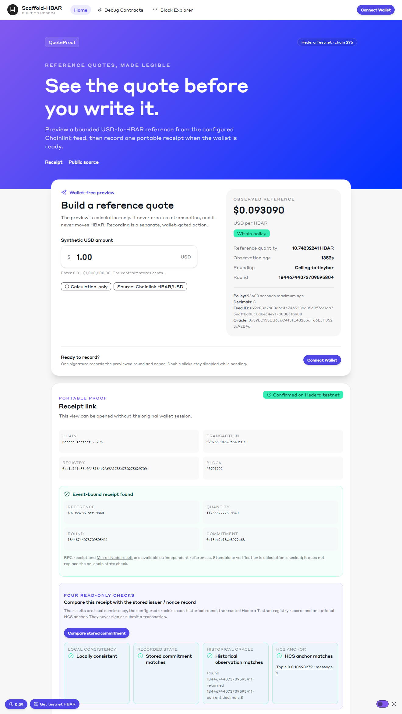
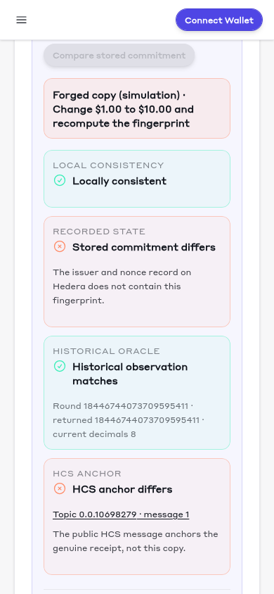
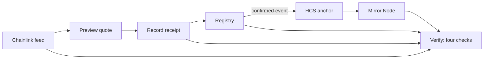

# QuoteProof — reference-quote receipts on Hedera

QuoteProof is a template for developers building USD quotes in HBAR on Hedera Testnet. It records the price used so anyone can check a receipt later.

[Open the live judge preview](https://quoteproof-judge-preview.vercel.app/) or [inspect the historical receipt](https://quoteproof-judge-preview.vercel.app/?tx=0x076690438e81f96fc77f3f6467157d2f53c05703ef098790a42b82909a340ef9&hcsTopic=0.0.10698279&hcsSeq=1). Scroll to **Try to forge this receipt** to see which checks catch an altered amount or price.

<p></p>

New here? Follow the [15-minute tutorial](docs/TUTORIAL.md).

## Start here

Prerequisites: Node.js `>=20.18.3`, npm, and Git with `user.name` and `user.email` configured.

From an empty parent directory:

```bash
npm create scaffold-hbar@latest -- quoteproof --template ref-dev22/quoteproof-template --frontend nextjs-app --solidity-framework hardhat --network testnet --package-manager npm --skip-hedera-skills --skip-install
```

For setup errors, flag forwarding or download limits, see [Troubleshoot](docs/HOW-TO.md#troubleshoot).

Start the preview:

```bash
cd quoteproof
npm ci
npm run next:dev -- --hostname 0.0.0.0 --port 3001
```

Open `http://localhost:3001`; the first page load compiles the app.
No wallet, funds or environment variables are needed for this preview.
See [environment settings](docs/REFERENCE.md#environment-variables) and [Testnet setup](docs/HOW-TO.md#record-a-new-receipt-on-testnet) for your own deployment.

## How it works

The registry stores a quote's fingerprint and emits its fields, including the Chainlink round. Readers check the receipt's arithmetic, stored fingerprint and historical price. Optional HCS anchoring adds an operator record after confirmation, readable through the Mirror Node. The live receipt is anchored.


```mermaid
flowchart LR
  F[Chainlink feed] --> P[Preview quote] --> R[Record receipt] --> G[Registry]
  G -- confirmed event --> H[HCS anchor] --> M[Mirror Node] --> V[Verify: four checks]
  R --> V
  F --> V
  G --> V
```

## What each check catches

| Forged copy | Local arithmetic | Registry fingerprint | Historical oracle round | HCS anchor |
| --- | --- | --- | --- | --- |
| Add 1 tinybar | caught | skipped | skipped | skipped |
| $1.00 → $10.00, fingerprint recomputed | passes | caught | passes (the price is real) | caught |
| Double the price, fingerprint recomputed | passes | caught | caught | caught |

## Hedera and ecosystem pieces

| Piece | What QuoteProof uses it for | Code link |
| --- | --- | --- |
| Chainlink HBAR/USD proxy on Hedera Testnet | Pins the feed; reads the exact recorded round later. | [Feed configuration](packages/hardhat/deploy/03_deploy_quoteproof_registry.ts), [getRoundData](packages/nextjs/app/api/quote/compare/route.ts) |
| Smart Contract Service (registry) | Stores each issuer/nonce commitment and emits the receipt. | [QuoteProofRegistry](packages/hardhat/contracts/QuoteProofRegistry.sol) |
| Consensus Service (submit-key topic) | Anchors a confirmed receipt through a server-held submit key. | [Topic creation](packages/nextjs/scripts/createHcsTopic.cjs), [anchor route](packages/nextjs/app/api/quote/hcs/anchor/route.ts) |
| Mirror Node REST (independent read-back) | Reads the public HCS message and checks its payer and receipt fields. | [Verify route](packages/nextjs/app/api/quote/hcs/verify/route.ts), [message comparison](packages/nextjs/utils/quoteHcs.ts) |
| JSON-RPC relay | Reads the registry and oracle after checking the provider's chain ID. | [Preview](packages/nextjs/app/api/quote/preview/route.ts), [comparison](packages/nextjs/app/api/quote/compare/route.ts) |

## Docs map

- [Tutorial](docs/TUTORIAL.md): run the receipt and forgery checks.
- [How-to](docs/HOW-TO.md): adapt, test, record and troubleshoot.
- [Reference](docs/REFERENCE.md): API, fields, scripts and environment.
- [Explanation](docs/EXPLANATION.md): design, trust and limits. [All docs](docs/README.md).

## Live evidence

Testnet: [recorded receipt](https://hashscan.io/testnet/tx/0x076690438e81f96fc77f3f6467157d2f53c05703ef098790a42b82909a340ef9), [HCS message](https://testnet.mirrornode.hedera.com/api/v1/topics/0.0.10698279/messages/1), [registry and topic details](docs/release-evidence.md#live-evidence).

AI-assisted implementation and review; see [AGENTS.md](AGENTS.md) for development guidance.

[Security and dependency audit](docs/security.md) · [MIT license and upstream notice](LICENSE).
