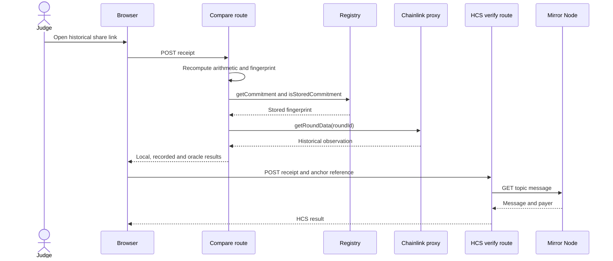

# Explanation

QuoteProof records a reference price, then checks the receipt against independent Hedera data. [How-to](HOW-TO.md) covers the steps; [reference](REFERENCE.md) lists the fields and routes.

## Why this design

- The registry stores a `keccak256` fingerprint per issuer and nonce to keep contract state compact. The event carries the quote fields, and a verifier recomputes the fingerprint from them.
- The receipt records the exact oracle round so verification compares the historical observation used at recording time, not a later price.
- The historical receipt stores Chainlink proxy round ID `18446744073709595411` (phase 1, aggregator round 43795). The [compare route](../packages/nextjs/app/api/quote/compare/route.ts) calls `getRoundData` on the proxy with that ID, so it reads the same observation after newer rounds exist.
- The server anchors to HCS only after it confirms a successful transaction with one matching `QuoteRecorded` event, avoiding an anchor for an unconfirmed receipt.
- A verifier can recompute the receipt, read the historical oracle round and registry commitment, and check the HCS message.
- The `93,600`-second (26-hour) reference-demo limit is the [testnet feed's published 24-hour heartbeat](https://reference-data-directory.vercel.app/feeds-hedera-testnet.json) plus a two-hour allowance. The contract rejects older observations; this application policy is not a trading-freshness guarantee.

## Four-check sequence

The preview route reads the configured Testnet registry and Chainlink proxy without a wallet-originating `from` address. A wallet write calls `createQuote(cents, expectedRound, expectedNonce)`; the contract rechecks the observation and nonce before emitting `QuoteRecorded`. The receipt binds the chain, registry, issuer, nonce, oracle observation, calculated tinybars and commitment. The standalone verifier recomputes the receipt locally. The read-only compare route never signs or submits a transaction.

## Trust model

The compare route checks local arithmetic and fingerprint first. It then reads the registry commitment and historical oracle round through JSON-RPC. The HCS verifier reads a public Mirror Node message and checks its payer against the configured operator account. That account is the trust anchor for an anchor message. Mirror Node availability affects read-back; a gray result is not proof of a forged receipt.

For a receipt selected by an independent source, supply its expected commitment, issuer and nonce together. Do not derive those expected values from the receipt being tested. The [adversarial evidence](adversarial-evidence.md) shows why a locally consistent JSON file is not recorded-state proof.

## Where this pattern fits

Possible uses include USD invoices settled in HBAR, refund or payment disputes, and milestone or escrow releases that depend on a price. QuoteProof records the reference; your payment flow still moves the money.

## Limits

QuoteProof does not transfer HBAR or prove payment.

Anchoring the same receipt twice creates two HCS messages.

## Security notes

- `npm audit --omit=dev` reports high-severity advisories in dependencies used by the Scaffold-HBAR starter and the optional Hiero SDK integration. The installed SDK matches the latest npm release checked; npm also suggests a Next.js major upgrade, an older Hedera proto package, and a different burner-wallet version. Those proposed changes have not been validated with this template, so they were not applied.
- QuoteProof loads the Hiero SDK for optional HCS anchoring and its operator-key checks. The anchor route requires a bearer token, validates the receipt and its on-chain event, and submits an anchor with a fixed set of fields. The audit does not establish exploitability through QuoteProof's routes. See the [dated audit](security.md) for the findings and exact versions.
- Run `npm audit --omit=dev` yourself and review the advisories before any production use.
