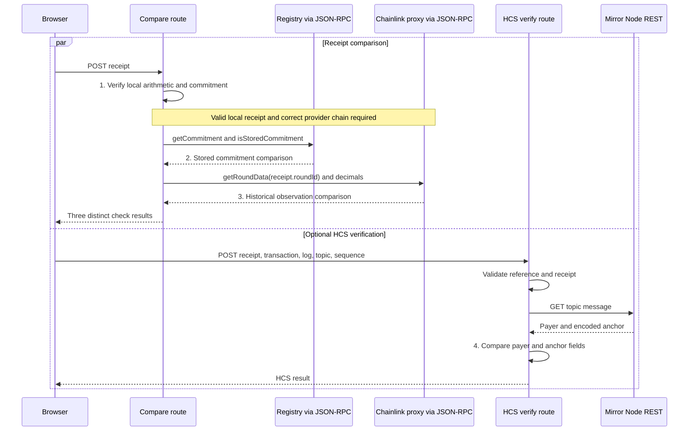

# Explanation

## Why this design

Sources: [registry](../packages/hardhat/contracts/QuoteProofRegistry.sol), [receipt verifier](../packages/hardhat/utils/quoteReceipt.ts), [historical fixture](../examples/receipt-testnet.json), and [anchor route](../packages/nextjs/app/api/quote/hcs/anchor/route.ts).

- The registry stores a `keccak256` fingerprint per issuer and nonce to keep contract state compact. The event carries the quote fields, and a verifier recomputes the fingerprint from them.
- The receipt records the exact oracle round so verification compares the historical observation used at recording time, not a later price.
- The historical receipt stores Chainlink proxy round ID `18446744073709595411` (phase 1, aggregator round 43795). The [compare route](../packages/nextjs/app/api/quote/compare/route.ts) calls `getRoundData` on the proxy with that ID, so it reads the same observation after newer rounds exist.
- The server anchors to HCS only after it confirms a successful transaction with one matching `QuoteRecorded` event, avoiding an anchor for an unconfirmed receipt.
- The `93,600`-second (26-hour) reference-demo limit is the [testnet feed's published 24-hour heartbeat](https://reference-data-directory.vercel.app/feeds-hedera-testnet.json) plus a two-hour allowance. The contract rejects older observations; this application policy is not a trading-freshness guarantee.

## Trust model

The [preview route](../packages/nextjs/app/api/quote/preview/route.ts) reads the Testnet registry and Chainlink proxy without a wallet-originating `from` address.
A wallet write calls `createQuote(cents, expectedRound, expectedNonce)`.
The contract rechecks the observation and nonce before emitting `QuoteRecorded`.
The receipt binds the chain, registry, issuer, nonce, oracle observation, calculated tinybars and commitment.
The standalone verifier recomputes the receipt locally.
The read-only comparison route checks the exact historical oracle round and the stored issuer/nonce record.
It never signs or submits a transaction.

The [published reference context](../packages/nextjs/contracts/quoteProofContext.ts) is Hedera Testnet chain `296`, QuoteProofRegistry `0xa1a741aF6e0A45164e2Af6A1C35dC30275629709`, and Chainlink proxy `0x59bC155EB6c6C415fE43255aF66EcF0523c92B4a`.
`observedAt` is the oracle's update time; `recordedAt` is the EVM block timestamp.
Neither is the per-transaction Hedera consensus timestamp.

For a receipt selected by an independent source, pass its expected commitment, issuer and nonce together. Do not derive those expected values from the receipt being tested. The complete schema, failure cases and read-only comparison behavior are in [adversarial evidence](adversarial-evidence.md) and the [verifier source](../packages/hardhat/utils/quoteReceipt.ts).

The [HCS reader](../packages/nextjs/utils/quoteHcs.ts) checks the topic, sequence, message payer and all eight anchor fields.
The operator account is the trust anchor: a message from another payer fails even if its receipt fields match.
The [anchor route](../packages/nextjs/app/api/quote/hcs/anchor/route.ts) checks the operator's public key and the topic's submit key before signing.
Mirror Node REST provides a public read-back independent of the browser's receipt copy.
These checks still depend on the configured RPC and Mirror Node responses; they are not a self-contained consensus proof.

## Four checks

The [browser comparison](../packages/nextjs/components/quoteproof/ReceiptProofCard.tsx) uses the [compare route](../packages/nextjs/app/api/quote/compare/route.ts) and [HCS verify route](../packages/nextjs/app/api/quote/hcs/verify/route.ts).
The browser starts both requests in parallel.
Each route validates the receipt before making its remote reads.
HCS verification is optional and uses a topic and sequence outside the receipt JSON.

## Where this pattern fits

Possible uses include USD invoices settled in HBAR, refund or payment disputes, and milestone or escrow releases that depend on a price. QuoteProof records the reference; your payment flow still moves the money.

## Limits

QuoteProof records a reference quote. It does not transfer HBAR or prove payment, balance, or a current market price.

Anchoring the same receipt twice creates two HCS messages; the [anchor route](../packages/nextjs/app/api/quote/hcs/anchor/route.ts) has no deduplication store.

## Security notes

- The [25 September 2026 audit](security.md) reported high-severity advisories in dependencies used by the Scaffold-HBAR starter and the optional Hiero SDK integration. On that date, the installed SDK matched the latest npm release checked; npm also suggested a Next.js major upgrade, an older Hedera proto package, and a different burner-wallet version. Those proposed changes have not been validated with this template, so they were not applied.
- QuoteProof loads the Hiero SDK for optional HCS anchoring and its operator-key checks. The anchor route requires a bearer token, validates the receipt and its on-chain event, and submits an anchor with a fixed set of fields. The audit does not establish exploitability through QuoteProof's routes. See the [dated audit](security.md) for the findings and exact versions.
- Run `npm audit --omit=dev` yourself and review the advisories before any production use.
